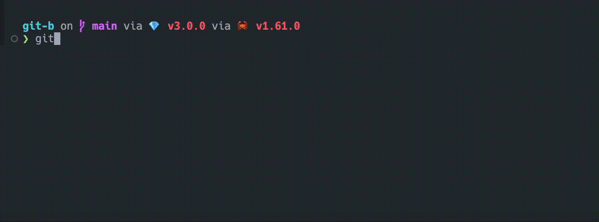

# git b

Fuzzy picker for checking out git branches



## Installation instructions

### Install on Mac

```sh
brew tap jharrilim/git-b
brew install git-b
```

### Install on Linux

- Download a linux release from the releases page (it'll have an `unknown-linux-gnu.tar.gz` suffix)
- Unpack with `tar xf git-b-v1.0.0-x86_64-unknown-linux-gnu.tar.gz` (includes `git-b` and `share/man/man1/git-b.1`)

### Install from source

> 🦀 You'll need to have [rust](https://rustup.rs/) installed

```sh
git clone https://github.com/jharrilim/git-b.git
cd git-b
cargo install --path .
```

### Configure git

To configure a `git b` alias, run:

```sh
git config --global alias.b '!git-b'
```


## Usage

Anywhere within a project under git source control, you may run `git-b`.
You may also configure a git alias for it, such as `git b`.

```sh
git-b              # open the fuzzy branch picker
git-b feature      # checkout the first branch matching "feature"
git-b -            # checkout the last checked-out branch
git-b ~2           # checkout the 2nd-to-last checked-out branch
git-b -b new-name  # git checkout -b new-name
man git-b          # after installing the man page (see below)
git-b --no-color   # disable picker colors for this run
```

### Colors

Picker lines show the branch name, short hash, and commit subject in separate colors. Defaults are cyan, yellow, and white.

Create `~/.git-b/config.toml`:

```toml
[colors]
enabled = true
name = "cyan"
hash = "yellow"
subject = "white"
```

Set `enabled = false` to turn colors off globally. Supported color names include `red`, `green`, `blue`, `magenta`, `cyan`, `gray`, and `bright-*` variants (for example `bright-green`). Use `default` or `none` to leave a field unstyled.

CLI flags override the config file for a single run: `--no-color`, or `--color NAME:HASH:SUBJECT` (for example `cyan:yellow:white`).

### Man page

Building from source generates `man/git-b.1` via [clap_mangen](https://crates.io/crates/clap_mangen). Install it with:

```sh
cargo build --release
sudo mkdir -p /usr/local/share/man/man1
sudo cp man/git-b.1 /usr/local/share/man/man1/
```

---

## Compiling from Mac to Linux

Due to [rust/issues/34282](https://github.com/rust-lang/rust/issues/34282), you'll need to run this
before running the `build` script:

```sh
brew tap SergioBenitez/osxct
brew install x86_64-unknown-linux-gnu
```
