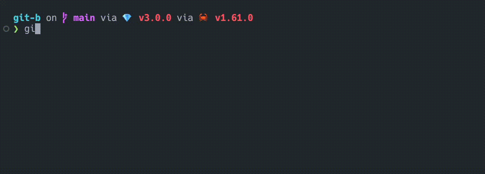

# git b

Fuzzy picker for checking out git branches



## Installation instructions

### Install on Mac

```sh
brew tap jharrilim/git-b
brew install git-b
```

### Install on Linux

- Download a linux release from the releases page (it'll have an `unknown-linux-gnu.tar.gz` suffix)
- Unpack it with `tar xf git-b-v1.0.0-x86_64-unknown-linux-gnu.tar.gz`

### Install from source

> 🦀 You'll need to have [rust](https://rustup.rs/) installed

```sh
git clone https://github.com/jharrilim/git-b.git
cd git-b
cargo install --path .
```

## Usage

Anywhere within a project under git source control, you may run `git-b`.
You may also configure a git alias for it, such as `git b`.

## Configure git

To configure a `git b` alias, run:

```sh
git config --global alias.b '!git-b'
```

---

## Compiling from Mac to Linux

Due to [rust/issues/34282](https://github.com/rust-lang/rust/issues/34282), you'll need to run this
before running the `build` script:

```sh
brew tap SergioBenitez/osxct
brew install x86_64-unknown-linux-gnu
```
